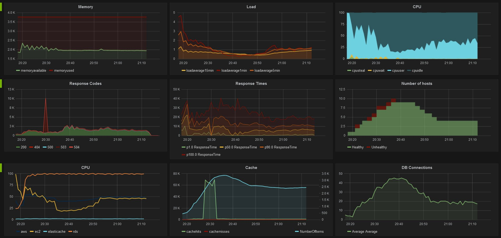

# grafana-xxl-solution
## About


[Grafana](https://grafana.com) is a tool for monitoring and managing Graphite, InfluxDB, Prometheus, Elasticsearch and many more databases.

Grafana XXL is a Grafana with all preinstalled (community) plugins from grafana.com.

**Here we run this tool in one command with [Containerum](https://containerum.com).**

We use [this image](https://hub.docker.com/r/monitoringartist/grafana-xxl/) from DockerHub.

## How to deploy on Containerum

**1.** Sign Up at [containerum.com](https://containerum.com)

**2.** Install CLI Containerum `chkit` following [instruction](https://containerum.com/documentation/Installing-Containerum-CLI-from-binaries).

**3.** Open Terminal and run `chkit login`

```
$ chkit login
Enter your email: test@gmail.com
Password:
********
Chosen namespace: mynamespace
Successful login
Token changed to:  QA0u64rOkTtCxxxxxxxxxxliUAnBnPlCbGQfpCQpzqM=
```
**4.** Use command `run solution`
